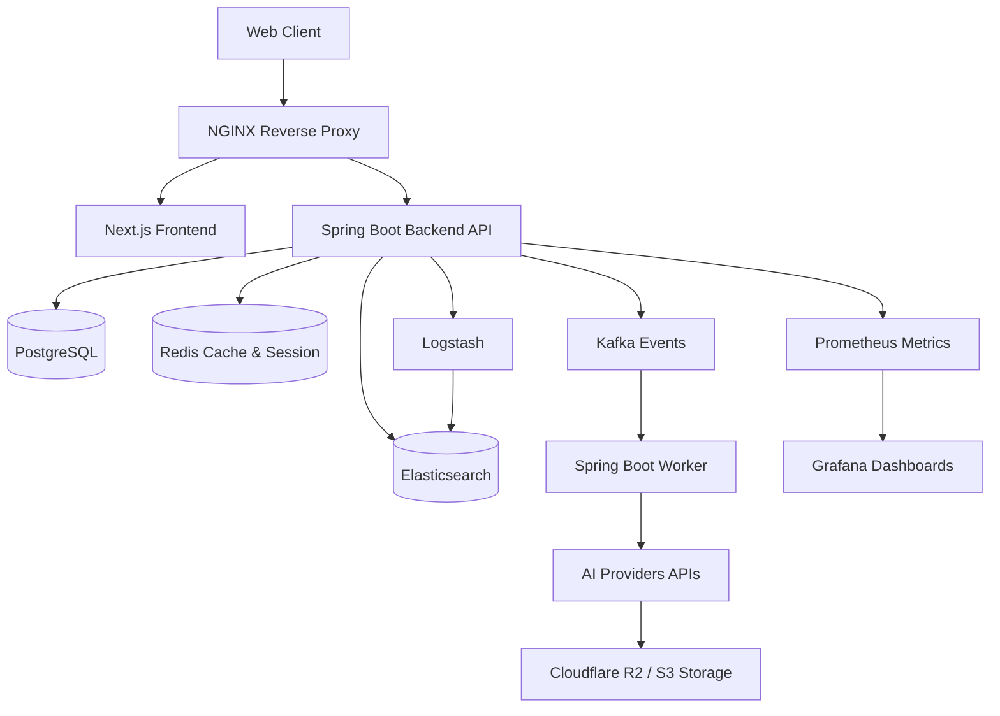

# Aura Video AI

[](https://github.com/aura-video-ai/aura-video-ai/actions)
[](https://opensource.org/licenses/MIT)
[](https://github.com/aura-video-ai/aura-video-ai)
[](https://hub.docker.com/)

## Overview
Aura Video AI is a production-grade AI Text-to-Video SaaS platform. It routes requests intelligently across multiple AI video generation providers (Google Veo, Runway, Luma, Pika, Kling, etc.) based on user preferences, cost, and availability.

## Architecture



## Quick Start

### Prerequisites
- Java 21
- Node.js 20+
- Docker and Docker Compose
- Maven

### Clone & Setup
```bash
git clone https://github.com/aura-video-ai/aura-video-ai.git
cd aura-video-ai
cp .env.example .env
# Fill in API keys in .env
```

### Run with Docker Compose
```bash
docker-compose up -d
```

### Access
- Frontend: `http://localhost:3000`
- Backend API: `http://localhost:8080`
- Swagger Docs: `http://localhost:8080/swagger-ui.html`
- Grafana: `http://localhost:3001` (admin/admin123)
- Kibana: `http://localhost:5601`
- Prometheus: `http://localhost:9090`

## Development Setup

### Backend (Spring Boot)
```bash
cd backend
mvn spring-boot:run
```

### Frontend (Next.js)
```bash
cd frontend
npm install
npm run dev
```

## Configuration

| Variable | Description |
|----------|-------------|
| `DB_URL` | PostgreSQL connection URL |
| `REDIS_HOST` | Redis host for caching and rate limiting |
| `KAFKA_BOOTSTRAP_SERVERS` | Kafka brokers |
| `JWT_SECRET` | Secret for signing JWT tokens |
| `STRIPE_SECRET_KEY` | Payment processing |
| `GOOGLE_VEO_API_KEY` | AI Provider key |

## API Documentation
The API is fully documented using OpenAPI 3.0. Once the backend is running, visit `http://localhost:8080/swagger-ui.html` for the interactive UI.

## AI Providers
To add a new AI provider:
1. Implement the `AiProviderClient` interface.
2. Add provider enum to `ProviderType`.
3. Add configuration properties.
4. Register with `AiRouterService`.

## Deployment
See `.github/workflows/cd-production.yml` for CI/CD setup. The application is designed to be deployed to Kubernetes. Helm charts are available in the `infra/k8s` directory.

## Contributing
Please read `CONTRIBUTING.md` for details on our code of conduct, and the process for submitting pull requests to us.
