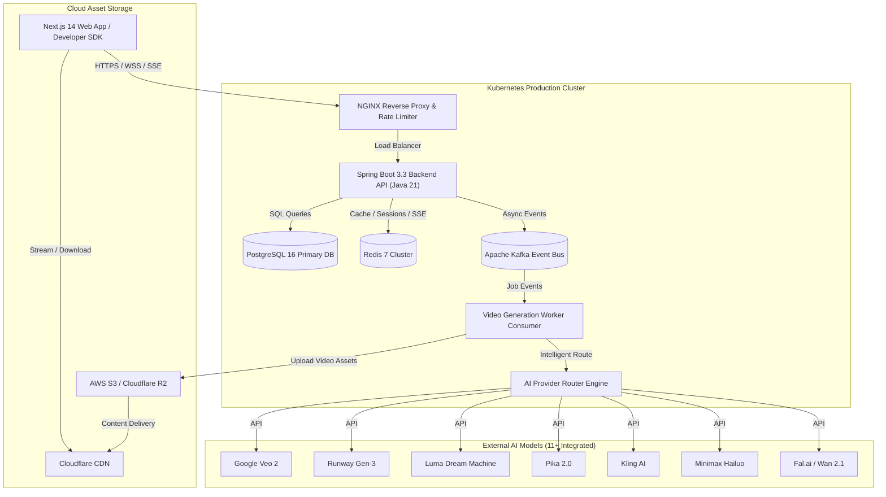
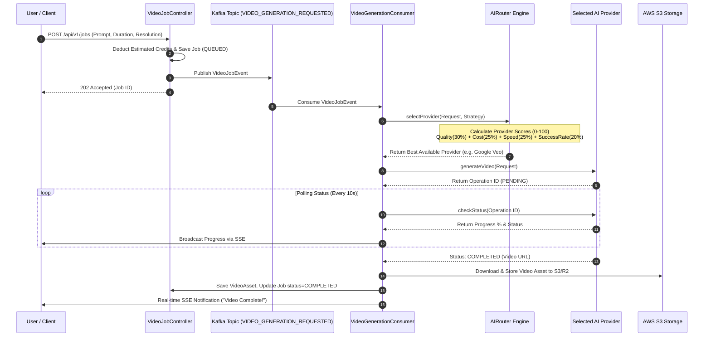
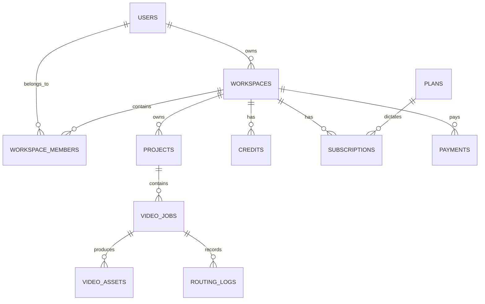

# Aura Video AI - Architecture Diagrams

This document contains Mermaid diagrams illustrating the core system architecture, data flows, and AI Router scoring engine.

---

## 1. System Architecture Overview

---

## 2. AI Router Scoring & Selection Flow

---

## 3. Database Entity Relationship Diagram (ERD)

